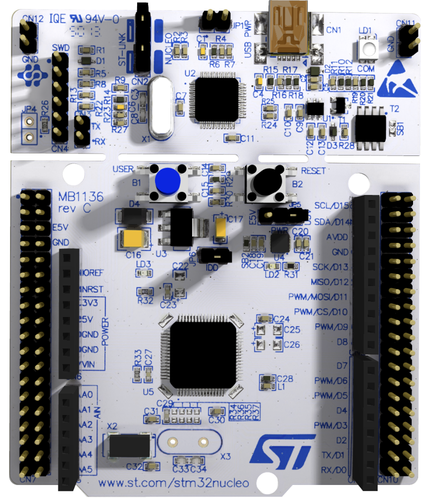
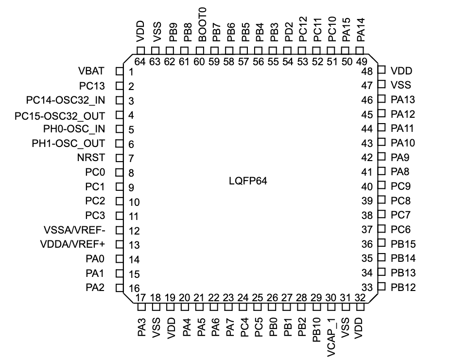

# STM32f446ret PlatformIO -C/Rust

Testing out development on platformio over STMcube IDE(too resource heavy).

## Created from Israle Gbati Udemy
### link: https://www.udemy.com/course/embedded-systems-bare-metal-programming
### board: https://www.st.com/en/microcontrollers-microprocessors/stm32f446re.html

## Refs - notes
- MCU pins are grped in PORTS. (pinout diagram below)

- PA5 - Port A Pin 5
- GPIO - general purpose i/o
- Micro-contrl Unit (mcu) will have atleast 2 regs:
    - direc. register (used to set i/o)
    - data register (Mode register for ST boards)
- MCU will have buses:
    - AHB (advanced high-perf. bus)
        - single clock cycle need
    - APB (advd periph. bus )
        - req. 2 clock access atleast
- MCU clock sources
    - on-chip RC(resis.-capa.) oscilltr. (least precise)
    - ext. connected crytal (most precise)
    - PLL(phase locked loop) (controllable - programmable)
